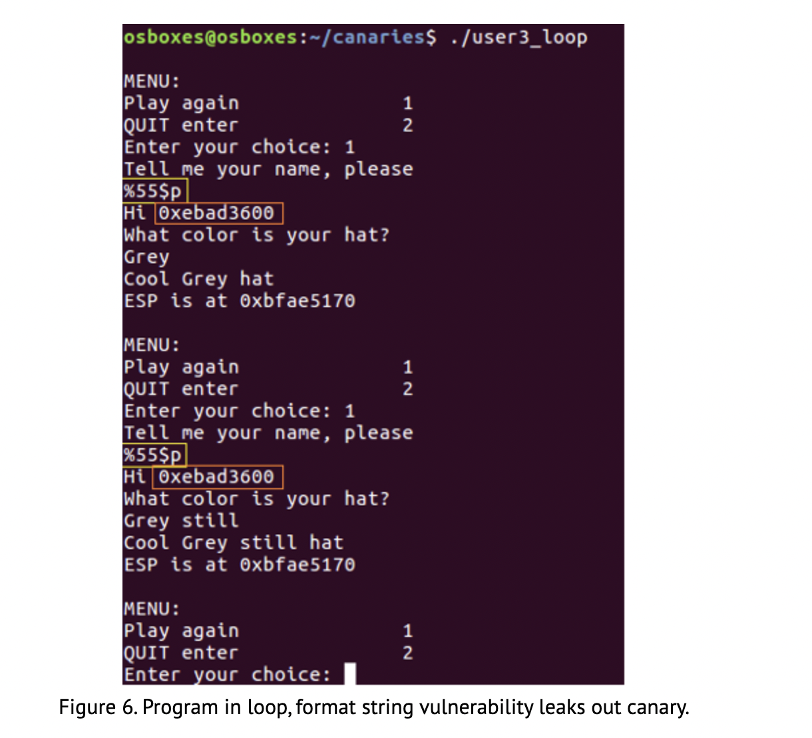

## Stack Canary Bypasses
### All Canaries
-  Leaking out the cookie value through a memory leak vulnerability.
	-  Format string vulnerabilities are excellent for this purpose.
	-  This can work against all types of canaries.
		-  With the possible exception of the Random XOR type.
	- The canary can also be avoided if the attacker can overwrite a buffer and then cause an exception to occur within the same function.
		- On Windows systems, this would trigger the structured exception handler (SEH) to intervene to solve the exception.
			-  If the SEH pointer is also overwritten, this can also lead to control over the instruction pointer. 
				-  The SEH routine will not check canary values before handing execution to the handler.
### Null Canary
- As discussed earlier, the read() function will allow us to write null bytes to a buffer, effectively disabling the security the null bytes should add.
- Furthermore, if multiple buffers can be written sequentially, the attacker may take use of null termination of strings in C to write the required NULL bytes into the canary position.
### Random 32 bit Canary
- In some occasions, brute forcing the canary may be successful.
	- The canary will have 24 bits of entropy.
	- This is due to the 8 bits (1 byte) being used for the NULL byte. 2^24 possibilities of randomisation makes 16.777.216 possible canary values.
		-  In a local privilege escalation exploit, 16 million guesses could well be within the bounds of a brute force attack.
### Random 64 bit Canary
- On 64 bit systems, that entropy increases to 2^56 or 7.20 * 10^16 possibilities. Brute forcing would be less feasible.
- However, our guessing can be steered a bit. 
	-  If we guess the canary byte by byte, we will be able to discern when we have guessed the right value. 
	-  This is possible because an incorrect guess for a byte will generate a stack smashing error.
		-  Where a correct byte guess will yield no such error.
	-  The maximum number (worst case) of guesses will remain 2^24, but the average number will decrease.