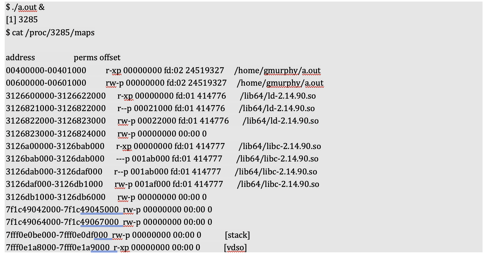

# Address Space Layout Randomization (ASLR)
- Each time an application runs it needs to be loaded from disk into virtual memory and have any runtime dependencies resolved by the dynamic loader before control is passed to the program’s main routine. ASLR randomises the positions of these elements within a virtual address space. 
- Therefore when ASLR is disabled, the way a program is mapped into memory is predictable.
- It is possible to examine the layout of a running process in virtual memory by examining the “/proc/self/maps” file of the process. This concept is demonstrated below:

- ASLR ensures that the location of the stack and heap is randomised each time the program is run.
	- The address of non-pre-linked libraries will also be randomised upon each execution.
	- The core system libraries are regularly pre-linked and will remain mapped to a constant address. 
		- Pre-linking is an optimisation technique that improves performance by  making the dynamic linker's life easier, at the cost of the library being located at a fixed location in memory (PIE mitigates this vulnerbility).

## How To Aattack (binaries without ASLR enabled):

## How To Aattack (binaries with ASLR enabled):

## Sources: