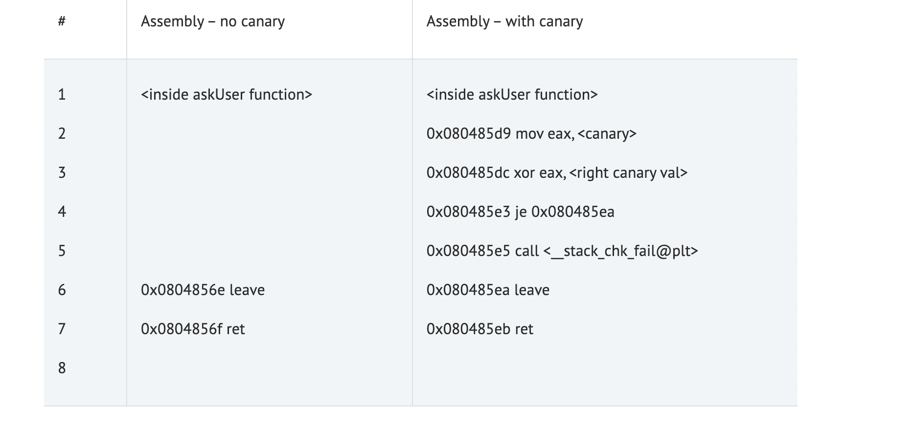
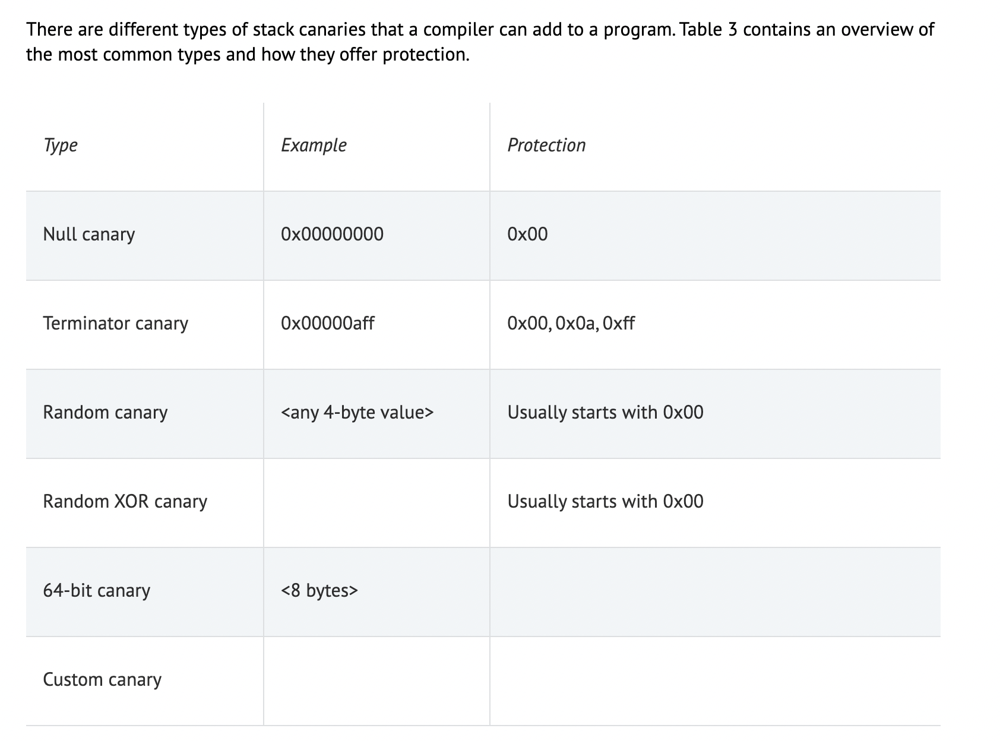
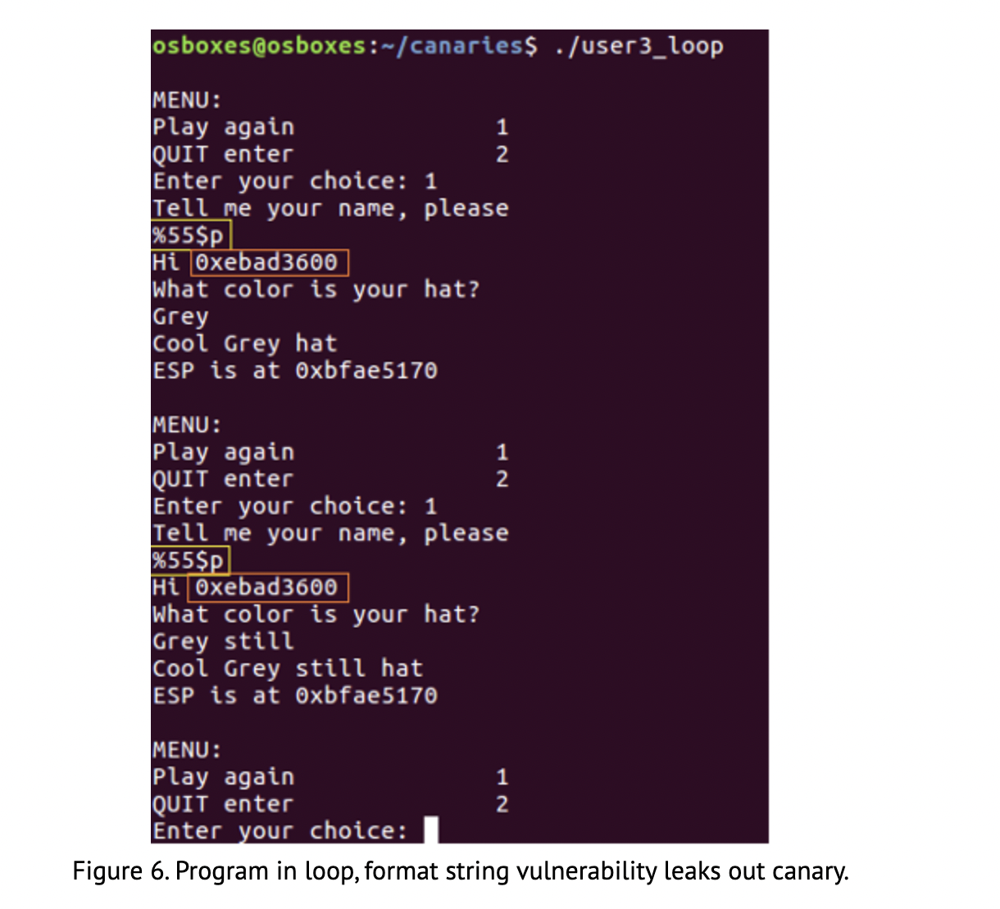

# Stack Canaries
- Stack canaries also called "security cookies"
- Stack canaries were invented to prevent buffer overflow (BOF) vulnerabilities from being exploited. 
-  Added to binaries during compilation to protect critical stack values like the Return Pointer against buffer overflow attacks.
-  If an incorrect canary is detected during certain stages of the execution flow, such as right before a return (RET), the program will be terminated. 
- The canary will change at every run of the program, making for a difficult to predict value. The NULL byte at the beginning of the canary would present a problem for many string operations to print.
- Stack canaries will be checked for their value just before the return to the calling function.
- Programs compiled with canaries will look different inside debugger, with added instructions just before the function epilogue and the subsequent return.
- As we can see in Table 2, the compiled version of the askUser function contains an extra check in lines 6 and 7. This check will copy the current canary value from the stack to the EAX register (line 2), XOR it against the stored correct value (line 3), and jump to the function epilogue if the values are equal (line 4). If the check fails, the stack_chk_fail function will be called (line 5). This will terminate the program, without the attacker ever gaining control of the Return Pointer and subsequently the Instruction Pointer.

## Stack canaries – types

- Many buffer overflow vulnerabilities are caused by string operations such as gets(), strcpy(), read(). Strings in C are commonly terminated using a single NULL byte (0x00). An attacker would not be able to use such a byte in their payload through a string operation to reconstruct the canary. The 0x0a byte represents a line feed, commonly also terminating string operations. 0xff corresponds to an End Of File (EOF), terminating certain string operations as well.
## Application of Stack Canaries
- The Linux C compiler gcc currently contains the Stack Smashing protector, which will introduce a random canary if /dev/urandom is available. 
-  In the absence of that source of random data, it will revert to a terminator canary.
-  gcc only introduces canaries in specific cases
	-  Functions with buffers over 8 bytes and calls to alloca() 
	-  The function that allows for allocation of memory space on the stack, will be protected by a canary.
	-  The programmer can introduce canaries for all functions with the –fstack-protector-all compiler flag
		-  This will likely hinder performance of the program.
-  Microsoft Visual Studio has the /GS flag that introduces canaries – named Security Cookies by Microsoft
## Canary Type Weaknesses:
### Null Canary
- The null canary would be the simplest for the compiler programmer to implement. It places 4 NULL bytes just before the SFP and RP. As this is a predictable value, an attacker may still be able to bypass the canary. 
### Terminator Canary
- The terminator canary introduces two more hex values that attempt to terminate string operations, 0x0a and 0xff. These values are again predictable, and can be bypassed with relative ease under the right conditions.
### Random Canary
- A random canary will offer better protection. It usually consists of a NULL byte followed by 3 random bytes. The NULL byte would attempt to terminate string operations, while the 3 random bytes will make the canary less predictable to the attacker.
### Random XOR Canary
- The random XOR canary will be like the random canary, except it will be XOR’ed against a non-static value in the program (usually the Base Pointer EBP). As operating systems nowadays run with Address Space Layout Randomization (ASLR) activated, EBP will not be static across runs of the program. This adds an extra layer of randomization to the cookie, making it hard to predict this value.
### 64-bit Canary
### Custom Canary
## Stack Canary Bypasses
### All Canaries
-  Leaking out the cookie value through a memory leak vulnerability.
	-  Format string vulnerabilities are excellent for this purpose.
	-  This can work against all types of canaries.
		-  With the possible exception of the Random XOR type.
	- The canary can also be avoided if the attacker can overwrite a buffer and then cause an exception to occur within the same function.
		- On Windows systems, this would trigger the structured exception handler (SEH) to intervene to solve the exception.
			-  If the SEH pointer is also overwritten, this can also lead to control over the instruction pointer. 
				-  The SEH routine will not check canary values before handing execution to the handler.
### Null Canary
- As discussed earlier, the read() function will allow us to write null bytes to a buffer, effectively disabling the security the null bytes should add.
- Furthermore, if multiple buffers can be written sequentially, the attacker may take use of null termination of strings in C to write the required NULL bytes into the canary position.
### Random 32 bit Canary
- In some occasions, brute forcing the canary may be successful.
	- The canary will have 24 bits of entropy.
	- This is due to the 8 bits (1 byte) being used for the NULL byte. 2^24 possibilities of randomisation makes 16.777.216 possible canary values.
		-  In a local privilege escalation exploit, 16 million guesses could well be within the bounds of a brute force attack.
### Random 64 bit Canary
- On 64 bit systems, that entropy increases to 2^56 or 7.20 * 10^16 possibilities. Brute forcing would be less feasible.
- However, our guessing can be steered a bit. 
	-  If we guess the canary byte by byte, we will be able to discern when we have guessed the right value. 
	-  This is possible because an incorrect guess for a byte will generate a stack smashing error.
		-  Where a correct byte guess will yield no such error.
	-  The maximum number (worst case) of guesses will remain 2^24, but the average number will decrease.
## Protection Against Stack Canary Bypasses
- There is no silver bullet solution to protecting against stack canary bypasses. If a program has a memory leak vulnerability, the attacker could leak out the cookie value. 
	- Only the random XOR’ed canary would offer protection against this.
- If an attacker can trigger an exception before the cookie is checked, code execution can still be obtained. 
	- The writeability of certain bytes (NULL, LF, EOF) will depend on the vulnerable function.
- Using languages that take care of memory management will greatly decrease the likelihood of a canary being bypassed.
	- C and C++ offer higher proformance but the programmer is in charge of memory management.  
- By far the greatest protection against canary bypassing lies in the very reason of the canary’s existence.
	- Stack canaries were invented to prevent buffer overflow (BOF) vulnerabilities from being exploited. 
	-  This BOF is the root problem that needs to be addressed.
		- To make a small analogy, an umbrella can protect against getting wet, but simply not walking in the rain will do that much more efficiently.
- Buffer overflow vulnerabilities occur when no bounds checking is being done on buffer operations. 
	- Functions such as gets() and strcpy() do no such bounds checking.
		- This is why they have been deprecated and replaced by fgets() and strlcpy().
			- These functions conduct correct bounds checking and, if correctly used, remove the buffer overflow vulnerability. 
			- Googling will effortlessly yield a list of insecure C functions and their safer variants.
## Sources: 
https://www.sans.org/blog/stack-canaries-gingerly-sidestepping-the-cage/