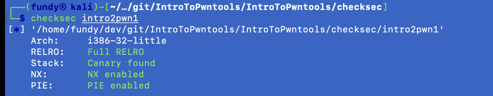
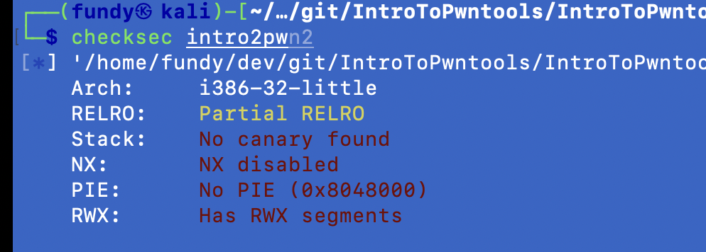
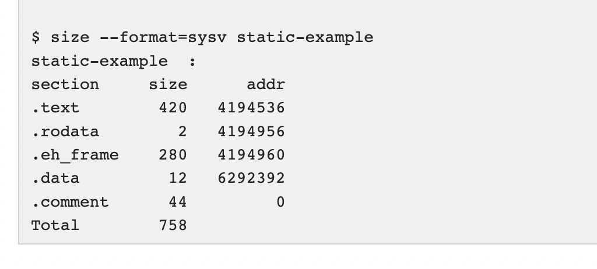

- checksec - A little tool for quickly surveying the mitigation technologies in use by processes on a Linux system \<binary>

https://www.trapkit.de/tools/checksec/

- objdump - display information from object files

- size - list section sizes and total size of binary files

