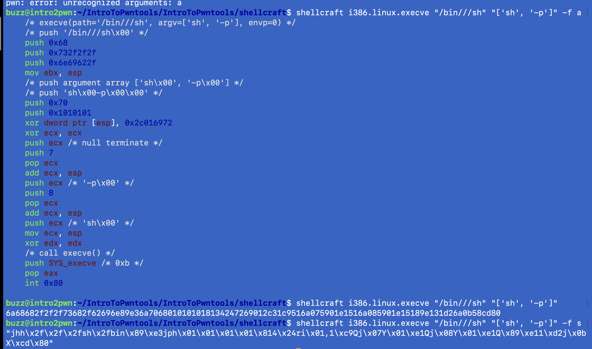

# What is shellcraft
- shellcraft can be used in the command line and inside python code. I like to use the command line, and copy and paste the shellcode over to my exploit script. The command line command for shellcraft is: shellcraft arch.OS.command, such as:

```bash
# This is for a basic bash shell for Linux executables 
# with i386 architecture. 

$ shellcraft i386.linux.sh

# print out the shell code in assembly view
$ shellcraft i386.linux.sh -f a

# Shellcode that passes our premissions
$ shellcraft i386.linux.execve "/bin///sh" "['sh', '-p']" -f a

# USE ME... Read Above if confused
$ shellcraft i386.linux.execve "/bin///sh" "['sh', '-p']" 
```

# shellcraft freatures
- A neat feature of shellcraft is that we can print out the shellcode in different formats with the -f flag. The possible formats are listed if you enter the shellcraft -h command.
- To write shellcode that is easier to use in our python exploit script, we can replace the "-f a" with "-f s"
- -f a = print shellcode in asmbly
- -f s = print shellcode in explot format
